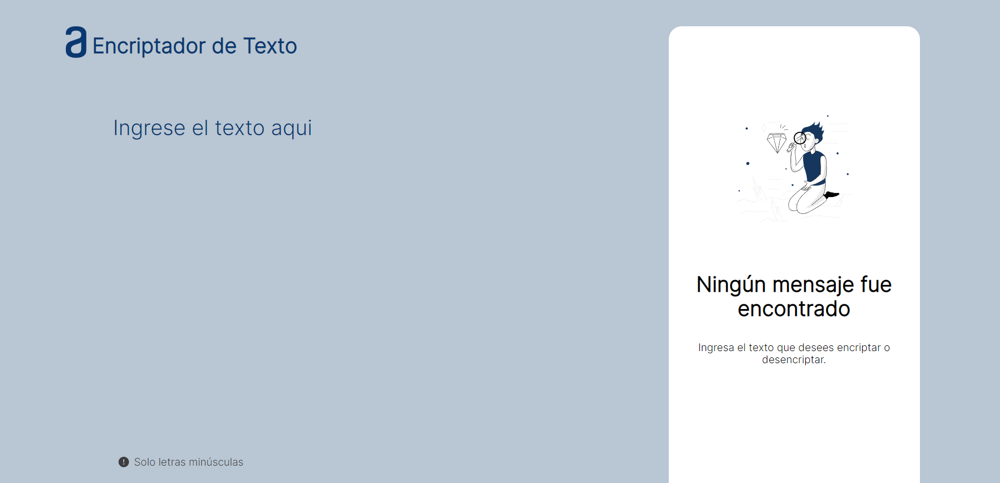

# Challenge Encriptador de One Next Education

Encriptador de texto ONE G5

## Descripción

El encriptador desarrollado utilizando tecnologías fundamentales como HTML, CSS y JavaScript, y presenta una sección en la que se muestra el resultado del texto cifrado o descifrado, además de un botón para copiar el resultado.

### Prueba la pagina aqui

[Challenge Encriptador de One Next Education](https://jsramirezch.github.io/Encriptador-de-Texto/](https://jsramirezch.github.io/Challenge-ONE-Portafolio-Encriptador-de-Texto-main/)

